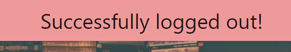

# Book Club

A book review website where user's can write and share reviews for specific books.

Created for my Code Institute Backend Development Milestone Project.

A link to the live site can be found [here](https://book-club-rob.herokuapp.com/).
 
## UX
 
### Primary Goals

To create a site where user's can easily write, share and read book reviews and find new books they want to read.

### Developer Goals

- To gain experience using Flask and MongoDB to create a full stack site backed by a well designed database.
- To create a site where I will be able to find new good books to read.

### User Stories

As a reviewer I want:

- An intuitive way to either register a new account or log into my existing account.
- An intuitive form for writing my review so I can easily write a new review including:
    - Star system to score my review out of 5.
    - Large text area to write up my review.
- A profile area where I can view the reviews I have written.
- A way to edit the reviews I have written so I can change them if I notice mistakes or change my mind about something.
- A way to delete reviews I no longer want to be on the website.

As a user (looking to buy a book) I want:

- A home page that displays the most recent reviews on the page so I can quickly see some reviews.
- A page where all the reviews are shown so I can see all the reviews.
- A search bar where I can search for reviews for a specific book I want to read.
- An intuitive layout for the page for each review so I can easily gain all the information I need.
- A way to upvote reviews I think were good so that other users can have an idea of which reviews are good.
- A link from each review to purchase the book so that I can easily buy the book if I decide I want to.

### Wireframes

- [Home Page](static/wireframes/home-page.pdf)
- [Book Page](static/wireframes/book-page.pdf)

## Features
 
### Existing Features

### Features Left to Implement

## Technologies Used

- [HTML5](https://en.wikipedia.org/wiki/HTML#:~:text=Hypertext%20Markup%20Language%20(HTML)%20is,scripting%20languages%20such%20as%20JavaScript.)
- [CSS3](https://en.wikipedia.org/wiki/CSS)
- [Materialize](https://materializecss.com/)
- [JavaScript](https://en.wikipedia.org/wiki/JavaScript)
- [JQuery](https://jquery.com)
- [Python](https://en.wikipedia.org/wiki/Python_(programming_language))
- [Flask](https://en.wikipedia.org/wiki/Flask_(web_framework))
- [MongoDB](https://www.mongodb.com/1)
- [Heroku](https://en.wikipedia.org/wiki/Heroku)

## Testing

- Testing the signup form on `signup.html`:
    - When the form is submitted with no username, it prompts you to fill in the username.
    
    - When the form is submitted with a username that is too short it prompts you to change the length of the username.
    
    - The form does not let you type a username longer than 15 characters.
    - When the form is submitted with a username that already exists a flash message appears saying the username already exists.
    
    - When the form is submitted with no email, it prompts you to fill in the email.
    
    - When the form is submitted with an invalid email, it prompts you to provide a valid email.
    
    - When the form is submitted with no password field, it prompts you to fill in the password.
    
    - When the form is submitted with a password that is too short, it prompts you to change the length of the password.
    
    - The form does not let you type a password longer than 15 characters.
    - When the form is submitted without filling in the confirm password field it prompts you to fill it in.
    
    - When the form is submitted without matching passwords a flash message appears to say this.
    
    - When the form is submitted with all the correct validation, the new user is added to the database and logged into the page.

- Testing the login form on `login.html`:
    - When the form is submitted with no username, it prompts you to fill in the username.
    
    - When the form is submitted with no password, it prompts you to fill in the password.
    
    - When the form is submitted with a username that does not exist, it provides a flash message and reloads.
    
    - When the form is submitted with the incorrect password, it provides a flash message and reloads.
    
    - When the form is submitted with a correct username and password it logs you in and redirects to the home page.

- Testing logout functionality:
    - When the user is logged in and clicks "logout" they are successfully logged out and redirected to the home page.
    

## Deployment

## Credits

### Code

- The script in `signup-validation.js` for checking the passwords match on `signup.html` was adapted from [this jsfiddle](http://jsfiddle.net/SirusDoma/ayf832td/).
- The code for the login and signup forms and methods was adapted from that used in the Code Institute Back End Development "Task Manager" miniproject.

### Content

### Media

### Acknowledgements