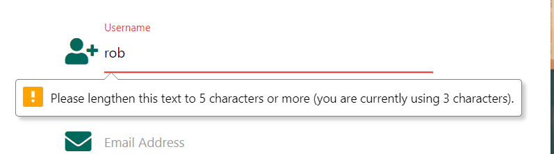
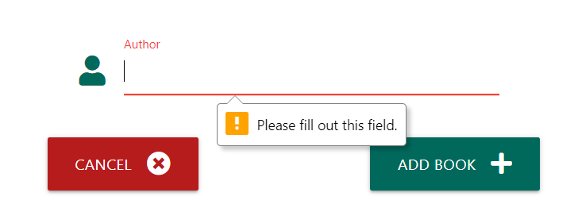
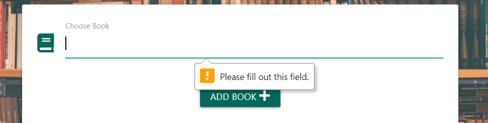
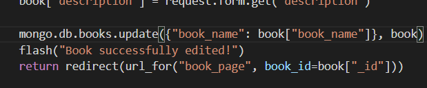
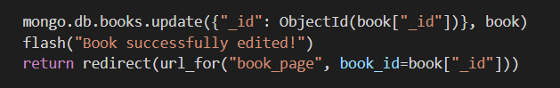
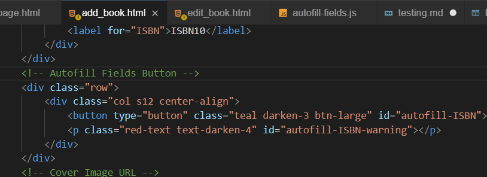

# Testing

## Testing the signup form on `signup.html`:

- When the form is submitted with no username, it prompts you to fill in the username.

- When the form is submitted with a username that is too short it prompts you to change the length of the username.

- The form does not let you type a username longer than 15 characters.
- When the form is submitted with a username that already exists a flash message appears saying the username already exists.

- When the form is submitted with no email, it prompts you to fill in the email.

- When the form is submitted with an invalid email, it prompts you to provide a valid email.

- When the form is submitted with no password field, it prompts you to fill in the password.

- When the form is submitted with a password that is too short, it prompts you to change the length of the password.

- The form does not let you type a password longer than 15 characters.
- When the form is submitted without filling in the confirm password field it prompts you to fill it in.

- When the form is submitted without matching passwords a flash message appears to say this.

- When the form is submitted with all the correct validation, the new user is added to the database and logged into the page.

## Testing the login form on `login.html`:

- When the form is submitted with no username, it prompts you to fill in the username.

- When the form is submitted with no password, it prompts you to fill in the password.

- When the form is submitted with a username that does not exist, it provides a flash message and reloads.

- When the form is submitted with the incorrect password, it provides a flash message and reloads.

- When the form is submitted with a correct username and password it logs you in and redirects to the home page.

## Testing logout functionality:

- When the user is logged in and clicks "logout" they are successfully logged out and redirected to the home page.

## Testing the add book functionality:

- When the form is submitted with no book name it prompts you to fill in the book name.

- When the form is submitted with no author it prompts you to fill in the author.

- If you try to add a book that already exists in the database a flash message appears to tell you this, you are redirected to the `add_review` page with the book field filled in and the book is not added.

- If you fill in a new book and it's author, you are redirected to the `add_review` page with the book field filled in and a flash message appears to say that you were successful in adding the review.

## Testing the add review functionality:

- When the form is submitted with no book it prompts you to fill in the book.

- When the form is submitted with a book that does not exist a flash message appears to tell you this.

- When the form is submitted with no review text it prompts you to fill in the review text.

- When the form is submitted with no star choice it does not let you submit the form.
- When the form is submitted with a book you've already reviewed a flash message appears to tell you this.

- When the form is submitted successfully a flash message appears to tell you this, you are redirected to the home page and the review is added to the database.

# Bugs Discovered

- Bug with `edit_book` method not editing the book:
    - While testing the edit_book method, I noticed that for some books the edit_book method was not actually editing the book when the form was submitted despite no errors showing up.
    - I then realised this was only happening when the title of the book was edited.
    - This was due to the POST method for the function updating the book in the database according to the book name:
    
    - If the book name had been changed, then nothing was getting updated in the database as there was no book in the database with the new book name.
    - I fixed this by changing the POST method to update the book record according to it's `_id` field:
    

- Bug with `add_book` page form submitting when autofill buttons are pressed:
    - While testing the autofill buttons on the `add_book` page, I noticed that if all the fields were filled the form was submitted when clicking the autofill buttons, not just the submit button.
    - After some googling, I discovered this was as I had not set the type of the autofill buttons so once I set their type attribute to `button`, the bug was fixed.
    